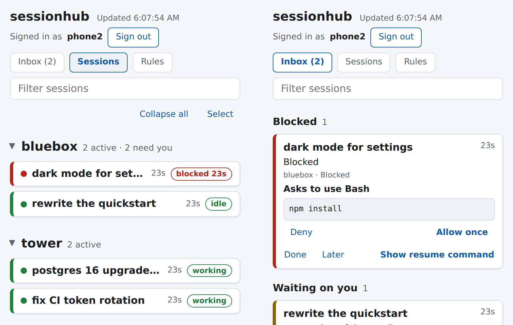

# sessionhub

One place to see and steer every Claude Code session you run, across all your
machines.

If you run several Claude Code sessions at once, on a laptop, a desktop and a
server, it gets hard to answer simple questions: which sessions are still
running, which one is stuck on a permission prompt, what did each one finish,
and how do I get back into it? sessionhub answers them from a dashboard, a
CLI, or a Telegram message.



## What it does

- **Registry.** Every Claude Code session on every joined machine shows up
  with its machine, directory, branch, title, and status (`live`, `blocked`,
  `stale`, `ended`).
- **Inbox.** Sessions that need you, across all machines: blocked on a
  permission prompt, waiting on an answer, or finished a turn you haven't
  read. Dismiss or snooze them, on the dashboard or with `sessionhub inbox`.
- **Remote approvals.** Allow or deny a waiting permission prompt from the
  dashboard, a phone, or `sessionhub approve`. The terminal prompt stays, and
  the first answer wins.
- **Progress reports.** An MCP server gives each session `report_progress`
  and `set_title`, so you see what it has done, what is in flight, and what
  it is waiting on without opening it.
- **Get back in.** `sessionhub resume <id>` focuses the session, restarts it,
  or prints the `ssh` command for the machine it is on. You can also turn on
  Claude Code Remote Control and continue in the Claude app.
- **Standing rules and messages.** Add a rule once and every session sees it
  with each prompt. Send a message to one session or to all of them.
- **Start sessions anywhere.** Start a new session on any machine from the
  dashboard or `sessionhub start`, with Remote Control on, and continue it
  from your phone.
- **Move sessions.** Hand a session, with its branch and uncommitted changes,
  to another machine or to a Claude Code cloud session.
- **Claude Code mod.** Optional, with `sessionhub install-mod`: the inbox
  shows the question a blocked session asks, the dashboard shows each
  session's context window fill, `sessionhub send` reaches sessions outside
  herdr, and Claude Code's status line shows the inbox counts.
- **Alerts.** Optional Telegram messages when a session has been blocked or
  waiting on you for 30 seconds.

Every client fails open. If the server is down, writes wait in a local queue,
and Claude Code is never blocked or slowed down.

## How it fits together

```
 your machines                                  one always-on host
┌──────────────────────────────┐               ┌──────────────────────┐
│ Claude Code                  │               │ sessionhub server    │
│  ├─ hooks ──────────────┐    │   HTTPS +     │  ├─ JSON API         │
│  └─ MCP server ─────────┼────┼── machine ───▶│  ├─ SQLite           │
│ herdr plugin (optional) ┘    │   token       │  ├─ dashboard        │
│ sessionhub CLI               │               │  └─ Telegram alerts  │
└──────────────────────────────┘               └──────────────────────┘
```

It is one static Go binary, `sessionhub`, that holds the server and every
client. [`ARCHITECTURE.md`](ARCHITECTURE.md) has the details.

## Requirements

- **Linux or macOS**, on the server and the client machines. The systemd
  unit and `make deploy` are Linux only; on a Mac, run `sessionhub server`
  yourself or under launchd. Windows isn't supported.
- **Claude Code** (`claude` on `PATH`) on each client machine.
- **Go 1.25** to build from source, or a release binary.
- Optional: **[herdr](https://herdr.dev) 0.9.3 or later**, an agent-aware
  terminal multiplexer. With it you get more: jumping straight to a session's
  pane, sending messages, Remote Control from the dashboard, moving sessions,
  and a sidebar summary. Without it, the hooks and the MCP server still
  register and track every session.

## Install

On Linux or macOS (amd64 or arm64):

```sh
curl -fsSL https://raw.githubusercontent.com/abdallah/session-hub/main/install.sh | sh
```

The script downloads the latest release, checks it against `checksums.txt`, and
installs `sessionhub` to `~/.local/bin`. Set `SESSIONHUB_VERSION=v0.1.1` to pin a
release or `SESSIONHUB_INSTALL_DIR` to install elsewhere.

You can also download a binary from the [releases page](https://github.com/abdallah/session-hub/releases)
and put it at `~/.local/bin/sessionhub`, or build it:

```sh
go install github.com/abdallah/session-hub/cmd/sessionhub@latest
mkdir -p ~/.local/bin && cp "$(go env GOPATH)/bin/sessionhub" ~/.local/bin/
```

or, from a clone, `make install`. The hooks, the MCP registration, and the
herdr plugin all call `~/.local/bin/sessionhub`, so the binary must be there.

## Quickstart

This runs the server and one client on the same machine, which takes about
five minutes. When you want more machines, follow
[`docs/self-hosting.md`](docs/self-hosting.md).

1. Create a server config. An empty file is enough; it tells `join` that this
   machine holds the server:

   ```sh
   mkdir -p ~/.config/sessionhub
   install -m 600 /dev/null ~/.config/sessionhub/server.toml
   ```

2. Start the server in another terminal (or as a service, see
   [`docs/self-hosting.md`](docs/self-hosting.md)):

   ```sh
   sessionhub server
   ```

3. Join this machine. That creates its token, writes
   `~/.config/sessionhub/config.toml`, adds the Claude Code hooks to
   `~/.claude/settings.json` (backing it up first), and registers the MCP
   server:

   ```sh
   sessionhub join localhost --name "$(hostname -s)"
   ```

   Optionally, add the Claude Code mod as well (see
   [`docs/cli.md`](docs/cli.md#sessionhub-install-mod)):

   ```sh
   sessionhub install-mod
   ```

4. Paste the snippet that `join` prints into `~/.claude/CLAUDE.md`, so
   sessions report their progress.

5. Start `claude` in any project and send a prompt. Then:

   ```sh
   sessionhub ls        # sessions on every machine
   sessionhub inbox     # the ones that need you
   sessionhub login --name laptop-browser   # a sign-in link for the dashboard
   ```

   Open the printed link to see the dashboard at `http://127.0.0.1:8787`.

## Documentation

| Doc | Covers |
|---|---|
| [`docs/usage.md`](docs/usage.md) | Day-to-day use: the inbox, approvals, rules, messages, resume, moves. |
| [`docs/self-hosting.md`](docs/self-hosting.md) | Running the server for several machines: systemd, Docker, a tunnel, Telegram, joining machines, upgrades, uninstall. |
| [`docs/cli.md`](docs/cli.md) | Every `sessionhub` command. |
| [`docs/server.md`](docs/server.md) | Server config, HTTP API, dashboard, and database. |
| [`docs/hooks.md`](docs/hooks.md) | The Claude Code hooks. |
| [`docs/mcp.md`](docs/mcp.md) | The MCP server and its tools. |
| [`docs/plugin.md`](docs/plugin.md) | The herdr plugin and its watcher. |
| [`docs/join.md`](docs/join.md) | `sessionhub join`. |
| [`docs/client.md`](docs/client.md) | The shared client library and the offline queue. |
| [`docs/upgrading.md`](docs/upgrading.md) | Release-specific upgrade steps. |
| [`docs/migrating-from-hub.md`](docs/migrating-from-hub.md) | Moving an install from the old `hub` name. |
| [`ARCHITECTURE.md`](ARCHITECTURE.md) | How the pieces fit, for contributors. |

## Security

The server can approve tool permissions and add instructions that every
session reads. Treat its URL and the machine tokens like SSH keys. Read
[`SECURITY.md`](SECURITY.md) before you expose the server beyond localhost.

## Status

sessionhub is a personal, single-user, self-hosted tool. One person runs it
across their own machines; there are no user accounts or teams. It is used
daily, and the API and database schema may still change between releases
(see [`docs/upgrading.md`](docs/upgrading.md)).

## Contributing

See [`CONTRIBUTING.md`](CONTRIBUTING.md).

## License

[MIT](LICENSE)
