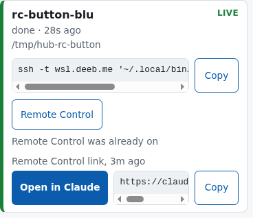
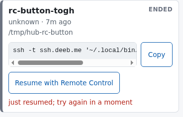

# Remote Control button evidence

Run on 2026-09-30 against the real sessionhub at `https://sessionhub.example.com`, from
`bluebox` (herdr 0.9.3, Claude Code 2.1.285) and `tower` (herdr 0.9.3), with
`sessionhub 7d3741e` built from this branch. Every pane used belongs to a scratch
workspace created with `--no-focus`: `w13` (`sessionhub-rc-button`) on `bluebox`, and
`wD` (`sessionhub-rc-button`) and `wE` (`sessionhub: rc-button-tower`, created by the
watcher) on `tower`. No other pane was touched. Remote Control links are
masked (`session_011y…`), and session and request IDs are cut to 8
characters. The read token was read over SSH into the tap script's
environment and never printed.

The resume path on `tower` failed, and the brief's stop rule applies: see
[Resume on tower](#resume-on-tower). The scratch workspaces are still open for
the phone check, so cleanup is left to the controller.

## Summary

| Check | Result |
|---|---|
| Deploy | `make deploy` backed up the database (`sessionhub.db.bak-20260930T175851`, schema version 2), migrated to version 3, and ended with `sessionhub 7d3741e`. `bluebox` runs `sessionhub 7d3741e` too. |
| Polling | Both watchers log `control: waiting for Remote Control requests` and run the installed binary (inodes match). Every live herdr session on both machines is `controllable`. |
| Inject on `bluebox` | **Pass.** Tap on **Remote Control**; the card shows **Open in Claude** and the link; the pane shows `/remote-control is active`; `sessionhub show` lists both events. |
| Resume on `tower` | **Fail (stop rule).** The watcher created `wE` without focus and reported `done`, "resumed in a new herdr workspace, link not seen", but Claude never started: tower's zsh asked its `compinit` question, which took the `c` of `claude`, and the pane ran `laude --resume …`. |
| No focus change | **Pass.** `tower`'s focused workspace was `w4` before and after both taps. |
| Double tap | **Pass.** A second tap 74 s after the resume got `failed`, "just resumed; try again in a moment". `herdr workspace list` still had one `sessionhub:` workspace, so there was no second `workspace.create` or `agent.start`. |
| Heartbeat after the resume | **Not run.** Nothing was resumed. As a partial check, the `bluebox` session was still `live` with its link 7.5 minutes (several heartbeats) after its tap. |
| CLI through the sessionhub | **Pass, in the other direction.** `sessionhub remote-control 69539db7` on `tower`, for the `bluebox` session, printed the link and `(Remote Control was already on)` through the sessionhub, exit 0, and the `bluebox` pane shows no dialog afterwards. The brief's direction (from `bluebox`, for the `tower` session) would have resumed that session again and failed the same way. |
| Phone check | **Pending.** the user opens the link on his phone; see [Phone](#phone). |
| Cleanup | **Left for the controller**, after the phone check. |

## Tests

`GOFLAGS=-count=1 make test lint` before the deploy, at `7d3741e`:

```
ok  	session-hub/cmd/sessionhub	0.022s
?   	session-hub/internal/api	[no test files]
ok  	session-hub/internal/cli	0.063s
ok  	session-hub/internal/cli/termtext	3.284s
ok  	session-hub/internal/client	5.862s
ok  	session-hub/internal/gitinfo	0.107s
ok  	session-hub/internal/herdr	2.369s
?   	session-hub/internal/herdr/herdrtest	[no test files]
ok  	session-hub/internal/hooks	6.693s
ok  	session-hub/internal/join	0.814s
ok  	session-hub/internal/mcp	0.613s
ok  	session-hub/internal/paths	0.004s
ok  	session-hub/internal/plugin	8.248s
ok  	session-hub/internal/resume	7.552s
ok  	session-hub/internal/server	11.991s
ok  	session-hub/internal/store	2.522s
test -z "$(gofmt -l .)"
go vet ./...
```

`lint` printed nothing else.

```
$ go test ./... -count=1 -v 2>&1 | grep -c '^--- PASS'
288
$ go test -count=1 -v -run 'TestAuthMatrix|TestDashboardRemoteControlStates' ./internal/server/ | grep -E 'auth matrix|dashboard states'
    auth_test.go:169: auth matrix: 13 routes x 10 credentials, 0 failures
    dashboard_test.go:301: dashboard states: 25 cases, 0 failures
```

The final review added a credential (a wrong `X-Hub-Action` value), so the
matrix has 10 credentials, not the plan's 9.

## Deploy and polling

```
$ make deploy
...
ssh tower 'db=$HOME/.local/share/sessionhub/sessionhub.db; test ! -f $db || { sqlite3 $db ".backup $db.bak-$(date +%Y%m%dT%H%M%S)" && ls -1t $db.bak-* | tail -n +4 | xargs -r rm -f; }'
ssh tower 'chmod 0755 ~/.local/bin/sessionhub.new && mv -f ~/.local/bin/sessionhub.new ~/.local/bin/sessionhub'
ssh tower 'systemctl --user daemon-reload && systemctl --user enable --now sessionhub && systemctl --user restart sessionhub'
ssh tower 'for i in 1 2 3 4 5; do curl -fsS http://127.0.0.1:8787/healthz && exit 0; sleep 1; done; ...'
ok
...
stopped the running watcher
sessionhub plugin startup: sent 2 sessions for herdr session "default"
ssh tower '~/.local/bin/sessionhub version'
sessionhub 7d3741e

$ ssh tower 'ls -l ~/.local/share/sessionhub/ | grep bak'
-rw-r--r-- 1 abdallah abdallah 241664 Sep 30 17:58 sessionhub.db.bak-20260930T175851
$ ssh tower 'sqlite3 ~/.local/share/sessionhub/sessionhub.db "PRAGMA user_version"'
3
$ ssh tower 'sqlite3 ~/.local/share/sessionhub/sessionhub.db.bak-* "PRAGMA user_version"'
2

$ make install && sessionhub install-plugin
...
stopped the running watcher
sessionhub plugin startup: sent 1 sessions for herdr session "default"
$ sessionhub version
sessionhub 7d3741e
```

Both watchers run the installed binary:

```
$ p=$(cat ~/.local/state/sessionhub/watcher.lock); stat -Lc '%i %n' /proc/$p/exe ~/.local/bin/sessionhub   # bluebox
8708862 /proc/17194/exe
8708862 /home/me/.local/bin/sessionhub
$ grep -c 'control: waiting for Remote Control requests' ~/.local/state/sessionhub/watcher.log
1
# tower, same commands:
46177948 /proc/217574/exe
46177948 /home/me/.local/bin/sessionhub
1
```

Every live session with a herdr pane counts as polling (17:59:23, 28 s after
`tower`'s watcher restarted):

```
$ curl -fsS -H "Authorization: Bearer $TOKEN" 'https://sessionhub.example.com/v1/sessions?live=true' | python3 -c '...'
bluebox 7684db37 live True True
tower 600a66d0 live True True
tower a95eafb5 live True True
```

The columns are machine, ID, status, has a herdr pane, and `controllable`.

## Inject on bluebox

```
$ herdr workspace create --no-focus --label sessionhub-rc-button --cwd /tmp/sessionhub-rc-button
... "pane_id":"w13:p1" ... "workspace_id":"w13" ... "focused":false ...
$ herdr agent start sessionhub-rc-btn-bluebox --kind claude --pane w13:p1
... "agent_session":{... "value":"69539db7-…"} ... "agent_status":"idle" ...
$ herdr pane get w13:p1          # checked before every prompt
w13 w13:p1 claude 69539db7 idle
$ herdr agent prompt w13:p1 'Reply with the single word ok.'
$ curl -fsS -X POST -H "Authorization: Bearer $TOKEN" ... -d '{"title":"rc-button-bluebox"}' .../v1/sessions/69539db7-…/title
69539db7 rc-button-bluebox live True
$ node docs/dev/evidence/remote-control-button-tap.mjs rc-button-bluebox docs/dev/evidence/remote-control-button-bluebox.png
before: rc-button-blulivedone · 26s ago/tmp/sessionhub-rc-buttonssh -t bluebox.example.com '~/.local/bin/sessionhub resume 69539db7…'CopyRemote Control
tapped: Remote Control
after: rc-button-blulivedone · 31s ago/tmp/sessionhub-rc-buttonssh -t bluebox.example.com '~/.local/bin/sessionhub resume 69539db7…'CopyRemote ControlRemote Control link, 2s agoOpen in Claudehttps://claude.ai/code/session_<masked>
```

The link came back within 2 seconds of the tap. The pane:

```
$ herdr pane read w13:p1 --source recent-unwrapped --lines 60 | grep -n remote-control
14:❯ /remote-control
16:  /remote-control is active · Continue here, on your phone, or at https://claude.ai/code/session_011y…
```

The events and the watcher's log line:

```
$ sessionhub show 69539db7
...
events (9, newest first)
  2026-09-30T18:00:32Z  plugin   remote_control_result  {"request_id":"cr_9ZgNs…","state":"done","url":"https://claude.ai/code/session_011y…
  2026-09-30T18:00:30Z  server   remote_control_requested  {"request_id":"cr_9ZgNs…","requested_by":"dashboard"}
  ...
$ grep 'control: request' ~/.local/state/sessionhub/watcher.log
2026/09/30 18:00:33 control: request cr_9ZgNs… for session 69539db7-…: done
```



The screenshot is from `--look` at 18:12, after the CLI check below, so the
card also says "Remote Control was already on".

## Resume on tower

```
$ ssh tower 'herdr api snapshot' | python3 -c '...focused_workspace_id...'
focused_workspace_id: w4
$ ssh tower 'herdr workspace create --no-focus --label sessionhub-rc-button --cwd /tmp/sessionhub-rc-button'
wD sessionhub-rc-button wD:p1 False
$ ssh tower 'herdr agent start sessionhub-rc-btn-tower --kind claude --pane wD:p1'
{"error":{"code":"timeout","message":"timed out waiting for agent startup"},"id":"cli:agent:start"}
```

The first `agent.start`, typed by hand into a new `tower` shell, already hit
the problem that later broke the resume:

```
$ ssh tower 'herdr pane read wD:p1 --source visible'
zsh compinit: insecure directories, run compaudit for list.
Ignore insecure directories and continue [y] or abort compinit [n]? claude
compinit: initialization aborted
lean-ctx: ON (track mode — full output, stats recorded)
me@tower [18:01:33] [/tmp/sessionhub-rc-button]
-> % laude
zsh: command not found: laude
```

A second `agent start` in the same pane, now at a prompt, reached Claude's
folder-trust prompt (`agent_not_ready`). I chose **Yes, I trust this folder**
for `/tmp/sessionhub-rc-button` with `herdr pane send-keys wD:p1 down enter`, which
added that directory to `tower`'s Claude trust list. The session is `76a9aa63`.

```
$ ssh tower "herdr agent prompt wD:p1 'Reply with the single word ok.'"
$ ssh tower 'curl ... -d "{\"title\":\"rc-button-tower\"}" http://127.0.0.1:8787/v1/sessions/76a9aa63-…/title'   # tower's token
76a9aa63 rc-button-tower live True /tmp/sessionhub-rc-button
$ ssh tower 'herdr agent prompt wD:p1 /exit'
$ sessionhub ls --all --machine tower    # every 5 s
18:03:55 tower     76a9aa63  rc-button-tower    live    7s   -
18:04:01 tower     76a9aa63  rc-button-tower    live    13s  -
18:04:07 tower     76a9aa63  rc-button-tower    ended   19s  -
$ node docs/dev/evidence/remote-control-button-tap.mjs rc-button-tower ...
before: rc-button-towerendedunknown · 43s ago/tmp/sessionhub-rc-buttonssh -t tower.example.com '~/.local/bin/sessionhub resume 76a9aa63…'CopyResume with Remote Control
tapped: Resume with Remote Control
after: rc-button-towerendedunknown · 1m ago/tmp/sessionhub-rc-buttonssh -t tower.example.com '~/.local/bin/sessionhub resume 76a9aa63…'CopyResume with Remote Controlresumed in a new herdr workspace, link not seen
```

The watcher created the workspace without focus, with the right label:

```
$ ssh tower 'herdr workspace list'
[('w4', 'Behind VPN for employees', True), ('w7', 'CF Log on production', False), ('w8', 'Recovery plan', False), ('wC', 'app', False), ('wD', 'sessionhub-rc-button', False), ('wE', 'sessionhub: rc-button-tower', False)]
$ ssh tower 'grep control: ~/.local/state/sessionhub/watcher.log | tail -1'
2026/09/30 18:04:45 control: request cr_srGoc… for session 76a9aa63-…: done resumed in a new herdr workspace, link not seen
```

But Claude never started in it:

```
$ ssh tower 'herdr pane get wE:p1'
wE wE:p1 None  unknown False
$ ssh tower 'herdr pane read wE:p1 --source recent-unwrapped --lines 200'
claude --resume 76a9aa63-… --remote-control
zsh compinit: insecure directories, run compaudit for list.
Ignore insecure directories and continue [y] or abort compinit [n]? compinit: initialization aborted
lean-ctx: ON (track mode — full output, stats recorded)
me@tower [18:04:31] [/tmp/sessionhub-rc-button]
-> % laude --resume 76a9aa63-… --remote-control
zsh: command not found: laude
```

What this shows:

- **The environment.** Every new interactive zsh on `tower` asks the
  `compinit` question before its first prompt. `compaudit` lists
  `~/.oh-my-zsh/custom/plugins/zsh-completions` and its `src` directory.
  `bluebox` has no such prompt, which is why the resume worked there in earlier
  runs.
- **The code gap.** `resumeInWorkspace` reports `OutcomeResumed` as soon as
  herdr accepts `agent.start`, without checking that Claude runs in the pane,
  so the card said "resumed" when nothing was. The result came at 18:04:45,
  15 s (`controlPollFor`) after the request. The socket `agent.start` the
  watcher sent returned success, while the CLI `herdr agent start` above
  timed out waiting for startup; I observed that difference but didn't
  confirm why. The brief's suggested fix, one retry of `agent.start` after a
  short wait, needs a trigger, such as a `pane.get` that shows no `claude`
  agent a few seconds after the start.

Per the brief, this needs a fix in `resumeInWorkspace`, not a note, so the
checks that depend on a working resume stop here.

### No focus change

`tower`'s focused workspace was `w4` before the scratch workspace, after the
resume, and after the double tap (the `True` in each `herdr workspace list`
above and below).

### Double tap

The second tap at 18:05:56 fell inside the watcher's 2-minute
recently-resumed window:

```
$ node docs/dev/evidence/remote-control-button-tap.mjs rc-button-tower ...
before: rc-button-towerendedunknown · 2m ago/tmp/sessionhub-rc-buttonssh -t tower.example.com '~/.local/bin/sessionhub resume 76a9aa63…'CopyResume with Remote Controlresumed in a new herdr workspace, link not seen
tapped: Resume with Remote Control
after: rc-button-towerendedunknown · 2m ago/tmp/sessionhub-rc-buttonssh -t tower.example.com '~/.local/bin/sessionhub resume 76a9aa63…'CopyResume with Remote Controljust resumed; try again in a moment
$ ssh tower 'herdr workspace list'
[('w4', 'Behind VPN for employees', True), ('w7', 'CF Log on production', False), ('w8', 'Recovery plan', False), ('wC', 'app', False), ('wD', 'sessionhub-rc-button', False), ('wE', 'sessionhub: rc-button-tower', False)]
$ ssh tower 'grep control: ~/.local/state/sessionhub/watcher.log | tail -2'
2026/09/30 18:04:45 control: request cr_srGoc… for session 76a9aa63-…: done resumed in a new herdr workspace, link not seen
2026/09/30 18:05:59 control: request cr_btlPZ… for session 76a9aa63-…: failed just resumed; try again in a moment
$ sessionhub show 76a9aa63
events (15, newest first)
  2026-09-30T18:05:59Z  plugin   remote_control_result  {"detail":"just resumed; try again in a moment","request_id":"cr_btlPZ…","state":"f…
  2026-09-30T18:05:59Z  server   remote_control_requested  {"request_id":"cr_btlPZ…","requested_by":"dashboard"}
  2026-09-30T18:04:45Z  plugin   remote_control_result  {"detail":"resumed in a new herdr workspace, link not seen","request_id":"cr_srGoc…
  2026-09-30T18:04:30Z  server   remote_control_requested  {"request_id":"cr_srGoc…","requested_by":"dashboard"}
  2026-09-30T18:04:01Z  plugin   ended  {"reason":"missing_from_snapshot"}
```

`wE:p1` runs no Claude, so the guard answered "just resumed" instead of
sending `/remote-control`; it didn't create a workspace or start an agent.



The screenshot is from `--look` at 18:12.

## CLI through the sessionhub

The brief runs `sessionhub remote-control <tower session>` from `bluebox`. By then the
`tower` session was ended, no pane ran it, and the 2-minute guard had run out,
so the request would have started a third workspace and failed the same way.
I ran the same code path in the other direction instead: `tower`'s CLI for the
`bluebox` scratch session, which `bluebox`'s watcher handles.

```
$ herdr pane get w13:p1
w13 w13:p1 69539db7 done
$ ssh tower '~/.local/bin/sessionhub remote-control 69539db7; echo "exit=$?"'
Asked machine "bluebox" to turn on Remote Control for session 69539db7. Waiting for it...
Remote Control is on for session 69539db7:
https://claude.ai/code/session_011y…
(Remote Control was already on)
exit=0
```

It took 4 seconds and printed the link from the sessionhub, not the `ssh` fallback.
The `bluebox` watcher took the link from Claude's already-on dialog and closed
it; the pane is back at its prompt:

```
$ herdr pane read w13:p1 --source visible | tail -6
  /remote-control is active · Continue here, on your phone, or at https://claude.ai/code/session_011y…
──────────────────────────
❯
──────────────────────────
  ⏵⏵ auto mode on (shift+tab to cycle) · ← 3 agents
$ grep 'control: request' ~/.local/state/sessionhub/watcher.log | tail -1
2026/09/30 18:07:42 control: request cr_xjTkQ… for session 69539db7-…: done Remote Control was already on
$ sessionhub show 69539db7
  2026-09-30T18:07:41Z  plugin   remote_control_result  {"detail":"Remote Control was already on","request_id":"cr_xjTkQ…","state":"done","…
  2026-09-30T18:07:39Z  server   remote_control_requested  {"request_id":"cr_xjTkQ…","requested_by":"machine:tower"}
```

Both sessions at 18:08:01:

```
$ curl ... /v1/sessions/<id> | python3 -c '...'
69539db7 live True w13:p1 rc_url: https://claude.ai/code/session_011y… 2026-09-30T18:07:41.629772646Z | last req: done Remote Control was already on
76a9aa63 ended True wD:p1 rc_url: - None | last req: failed just resumed; try again in a moment
```

## Phone

Pending. The controller asks the user to open the `rc-button-bluebox` link in the
Claude app and confirm it shows the session's last reply ("ok"). There is no
`tower` link to open, because the resume failed.

## Cleanup

Not done yet; the controller closes these after the phone check:

| Machine | Workspace | What |
|---|---|---|
| `bluebox` | `w13` (`sessionhub-rc-button`) | Scratch session `69539db7`, running, Remote Control on. |
| `tower` | `wD` (`sessionhub-rc-button`) | The pane where `76a9aa63` ran before `/exit`, now a shell. |
| `tower` | `wE` (`sessionhub: rc-button-tower`) | The watcher's resume workspace, a shell after `laude` failed. |

Also remove `/tmp/sessionhub-rc-button` on both machines. Closing `wD` can send
`pane_closed` for `76a9aa63`; that session is already ended, so it changes
nothing, but close it after any further check on that session.

## Re-test after the tower shell fix (2026-09-30, sessionhub a8d8b7a)

Check 2 failed because tower's zsh showed the `compinit` "insecure
directories" prompt at startup, which swallowed the `c` of `claude`.

Shell fix on tower, with the user's approval:

```
$ zsh -ic compaudit
There are insecure directories:
/home/me/.oh-my-zsh/custom/plugins/zsh-completions/src
/home/me/.oh-my-zsh/custom/plugins/zsh-completions
$ chmod g-w,o-w ~/.oh-my-zsh/custom/plugins/zsh-completions ~/.oh-my-zsh/custom/plugins/zsh-completions/src
$ stat -c '%a %n' …   # 775 → 755 for both
$ zsh -ic 'compaudit; echo compaudit-exit=$?'
compaudit-exit=0
```

sessionhub `a8d8b7a` also confirms Claude runs before it reports a resume. It was
deployed with `make deploy`, which wrote the backup `sessionhub.db.bak-20260930T183501`.

Check 2 (resume on tower), re-run through the sessionhub from bluebox, 21:49:24–21:49:32:

```
$ sessionhub remote-control 76a9aa63
Asked machine "tower" to turn on Remote Control for session 76a9aa63. Waiting for it...
Remote Control is on for session 76a9aa63:
https://claude.ai/code/session_01UE…
(resumed in a new herdr workspace)
exit=0
```

The new workspace is `wF` ("sessionhub: rc-button-tower"). tower's focused workspace
stayed `w4`.

Check 4 (heartbeat), 75 s after the resume, past a 60 s heartbeat:

```
status:    live
state:     idle
herdr:     session=default workspace=wF pane=wF:p1
API: status live | controllable True | url https://claude.ai/code/session_01UE… | rc_at 2026-09-30T18:49:29Z
```

The snapshot reconcile didn't end the resumed session, and its link stayed.

Aside: Cloudflare in front of sessionhub.example.com answers 403 to Python's default
`Python-urllib` user agent. sessionhub's Go client isn't affected. Scripts that call
the API directly should set a User-Agent.
